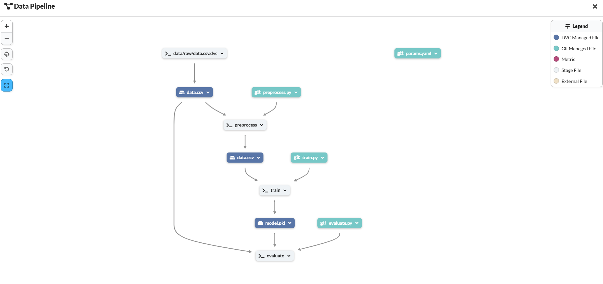
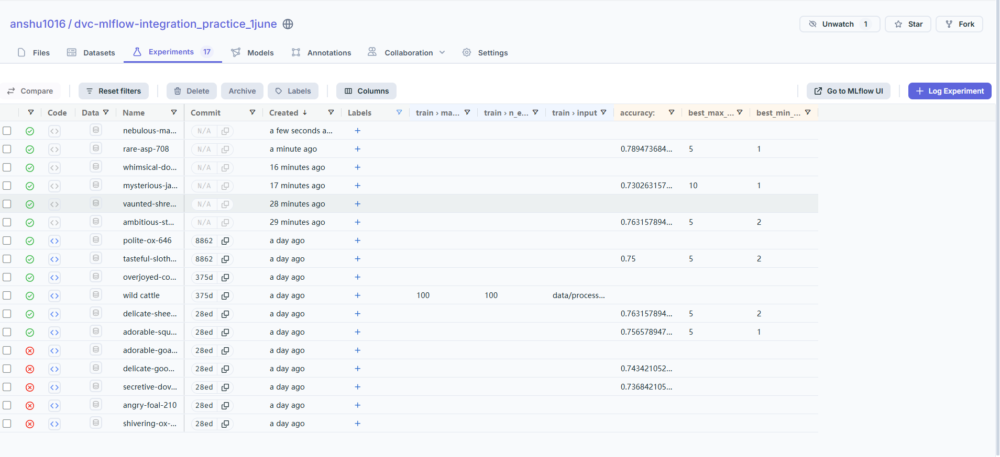

"# dvc-mlflow-integration_practice_1june" 

# E2E Pipeline with DVC, MLflow, and Docker

This repository contains a machine learning pipeline built with DVC and MLflow, containerized using Docker for reproducibility and easy deployment.

---

# Outout:

> 

> 

> 


## Prerequisites

- Docker installed ([Get Docker](https://docs.docker.com/get-docker/))
- Docker Hub account (for pushing/pulling images)
- Git installed
- (Optional) DVC installed locally if running outside Docker

---

## Project Structure

- `dvc.yaml`, `.dvc/` — DVC pipeline files  
- `src/` — Source code for training and preprocessing  
- `models/` — Model output directory (tracked by DVC)  
- `requirements.txt` — Python dependencies  
- `Dockerfile` — Docker image specification  
- `docker-compose.yml` — Docker Compose config for easy runs  

---

## Setup and Usage

### 1. Clone the repository

```bash
git clone https://github.com/anshu1016/E2E_pipeline_DVC_Dagshub_Practice.git
cd E2E_pipeline_DVC_Dagshub_Practice
```
### 2. Build the Docker image locally
```bash
docker build -t pipeline_practice .

```
### 3. Tag the image for Docker Hub
Replace your_dockerhub_username below with your Docker Hub username:

```bash
docker tag pipeline_practice your_dockerhub_username/pipeline_practice:latest

```
### 4. Log in to Docker Hub
```bash
docker login

```
### 5. Push the image to Docker Hub
```bash
docker push your_dockerhub_username/pipeline_practice:latest

```
### 6. Run the pipeline container
Run normally (runs pipeline, using cached stages):

```bash
docker run --rm -it your_dockerhub_username/pipeline_practice:latest

```
Run forcefully (ignore cache and rerun all stages):

```bash
docker run --rm -it your_dockerhub_username/pipeline_practice:latest dvc repro --force

```

Run with local code mounted (for development):

```bash
docker run --rm -it -v $(pwd):/app -w /app your_dockerhub_username/pipeline_practice:latest dvc repro --force

```
### 7. Run with Docker Compose (recommended for ease)
A docker-compose.yml is included. To run the pipeline forcefully:

```bash
docker compose up

```
This will mount your local folder and run:

```bash
    dvc repro --force
```
## Additional Notes
- To clear cache and force reruns manually, you can delete the models/ folder before running.

- MLflow tracking will log runs during the training stage.

- You can customize the Dockerfile and docker-compose.yml to expose ports if you want to use MLflow UI or a Flask app.

- For development, mounting the local folder ensures changes reflect immediately without rebuilding the image.


## Troubleshooting
- If you get errors like "not inside a DVC repository", ensure you run commands in /app inside the container where .dvc and dvc.yaml exist.

- Always tag the Docker image correctly with your Docker Hub username before pushing.

- Use docker login to authenticate before pushing images.

